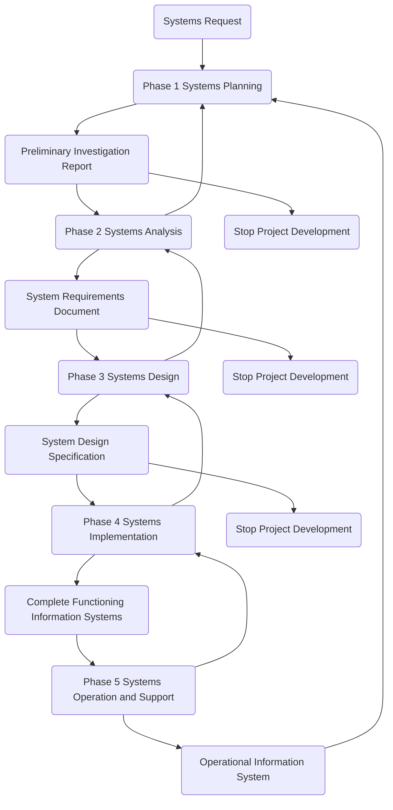

```mermaid
flowchart TD
1(Systems Request)
2(Phase 1 Systems Planning)
3(Preliminary Investigation Report)
4(Phase 2 Systems Analysis)
5(System Requirements Document)
6(Phase 3 Systems Design)
7(System Design Specification)
8(Phase 4 Systems Implementation)
9(Complete Functioning Information Systems)
10(Phase 5 Systems Operation and Support)
11(Operational Information System)

1 --> 2 --> 3 --> 4 --> 5 --> 6 --> 7 --> 8 --> 9 --> 10 --> 11
4 --> 2
6 --> 4
8 --> 6
10 --> 8
11 --> 2

3 --> 12(Stop Project Development)
5 --> 13(Stop Project Development)
7 --> 14(Stop Project Development)
```
