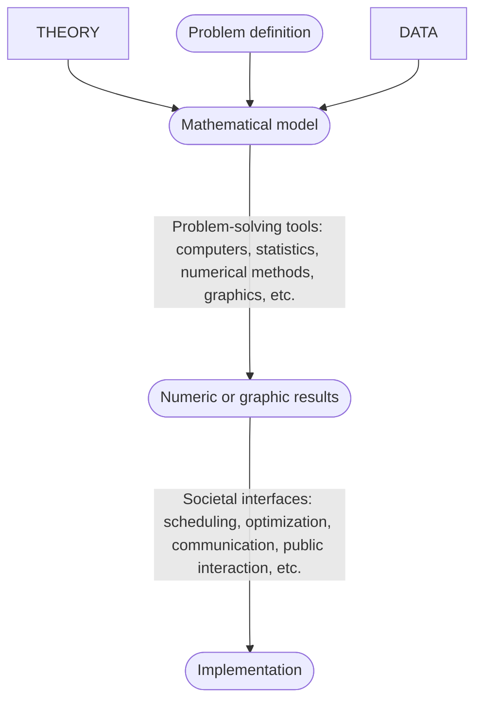

```mermaid
flowchart TD
PD([Problem definition])
MM([Mathematical model])
R([Numeric or graphic results])
I([Implementation])

THEORY --> MM
PD --> MM -- "`Problem-solving tools: computers, statistics, numerical methods, graphics, etc.`" ----> R -- "`Societal interfaces: scheduling, optimization, communication, public interaction, etc.`" ----> I
DATA --> MM

```
