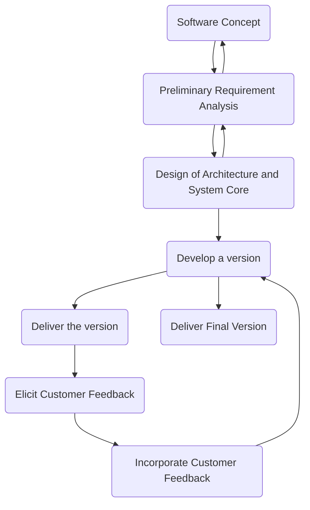

```mermaid
flowchart TD

1 --> 2 --> 3 --> 4 --> 7 --> 6 --> 5 --> 4 

4 --> 8

3 --> 2

2 --> 1

1(Software Concept)
2(Preliminary Requirement Analysis)
3(Design of Architecture and System Core)
4(Develop a version)
5(Incorporate Customer Feedback)
6(Elicit Customer Feedback)
7(Deliver the version)
8(Deliver Final Version)
```
