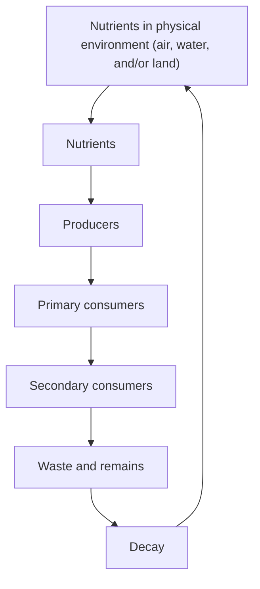

```mermaid
flowchart TD
1["Nutrients in physical environment (air, water, and/or land)"]
2[Nutrients]
3[Producers]
4[Primary consumers]
5[Secondary consumers]
6[Waste and remains]
7[Decay]

1 --> 2 --> 3 --> 4 --> 5 --> 6 --> 7 --> 1
```
