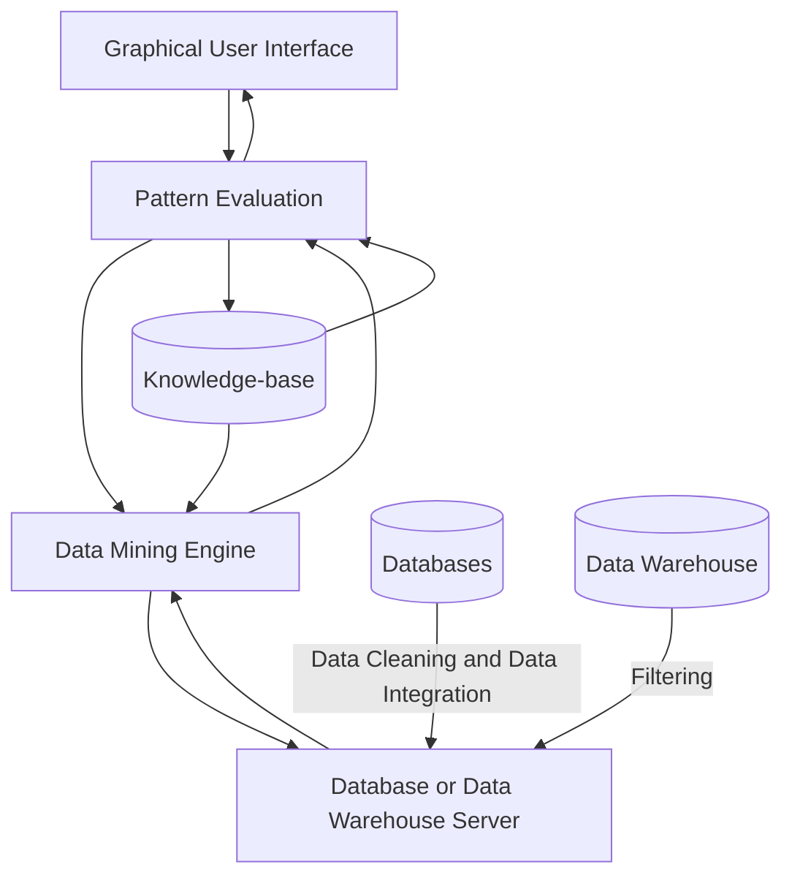

```mermaid
flowchart TD
GUI[Graphical User Interface]
PE[Pattern Evaluation]
DME[Data Mining Engine]
DWS[Database or Data Warehouse Server]
DB[(Databases)]
DW[(Data Warehouse)]
KB[(Knowledge-base)]

GUI --> PE --> DME --> DWS 

DWS --> DME
DB --"Data Cleaning and Data Integration"--> DWS
DW --"Filtering"--> DWS

DME --> PE
PE --> GUI


PE --> KB
KB --> PE
KB --> DME
```
